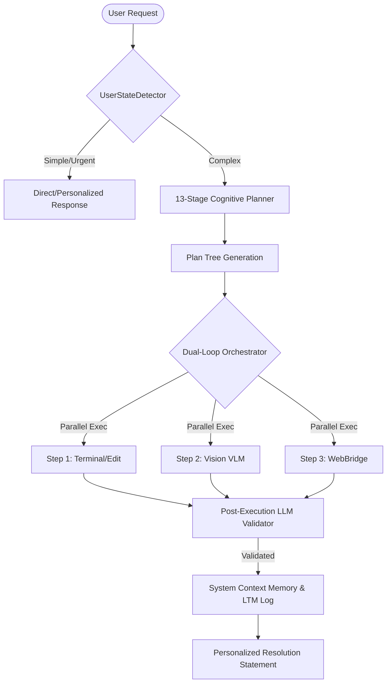

# 🧠 J.A.R.V.I.S — Universal Agentic Ecosystem (J.A.R.V.I.S-All)

> "Sir, I've compiled a comprehensive map of my evolutionary architecture. The universal agentic core is online."

Welcome to the central repository of the **J.A.R.V.I.S-All** ecosystem. This repository serves as the complete history, present status, and future vision of the Just A Rather Very Intelligent System (J.A.R.V.I.S) engineering lifecycle. From simple command routers to the state-of-the-art **J.A.R.V.I.S 10.0 Dual-Loop Parallel Orchestration Engine**, this project documents the continuous evolution of advanced local-first autonomous agents.

---

## 🌌 The Evolutionary Registry

The J.A.R.V.I.S ecosystem is divided into distinct versioned directories, each representing a core milestone in agentic capabilities and architectural sophistication.

| Version | Core Architectural Focus | Key Subsystems & Features | Status |
| :--- | :--- | :--- | :--- |
| **J.A.R.V.I.S 1.0** | **Autonomous AI Assistant Scaffold** | Voice recognition (STT), long-term cognitive memory (Cognee), offline Ollama-directed Claw agent brain. | Legacy / Stable |
| **J.A.R.V.I.S 2.0** | **Mind-Heart Separation Pattern** | Body-Part architecture with reasoning/delegation (`Mind`), user state/digital footprint (`Heart`), Fish Speech emotional TTS tags (`[excited]`, `[whisper]`). | Legacy / Stable |
| **J.A.R.V.I.S 3.0** | **Capability Acquirer & Plugin Manager** | Scoped tool registration hooks, active capability proposal and approval workflows. | Integrated |
| **J.A.R.V.I.S 4.0** | **Command & GitHub Subsystem Hub** | Autonomous git tracking, repository state awareness, monitoring hooks, automated issue resolution. | Integrated |
| **J.A.R.V.I.S 5.0** | **Advanced Automation & MLOps** | Model routing optimization, automated sandbox setup with Docker-native runtimes. | Integrated |
| **J.A.R.V.I.S 6.0** | **Active System Guardrails** | Automated local security auditing, compliance scans, and dependency vulnerability patching. | Integrated |
| **J.A.R.V.I.S 7.0** | **Multi-Agent Swarm Orchestration** | Concurrent agent networks communicating via Tmux sessions with cron-driven active jobs. | Integrated |
| **J.A.R.V.I.S 8.0** | **Vision VLM & Hardware Integrations** | Persistent camera streams, webcam captures, and OpenAI-compatible multi-modal VLM scene analysis. | Integrated |
| **J.A.R.V.I.S 9.0** | **Kimi Browser & WebBridge** | Chromium-based headless/headful autonomous web navigation, page analysis, and scraping. | Integrated |
| **J.A.R.V.I.S 10.0** | **Universal Agentic Core (Project X)** | Dual-loop async orchestration, parallel step executors, CLI self-correcting loop, agent memory system, dynamic vision sanitization. | **Active Development** |

---

## 🧬 Architectural Masterpiece: J.A.R.V.I.S 10.0 (Universal Core)

At the heart of the latest iteration, **J.A.R.V.I.S 10.0** combines all past features into a single, unified, high-performance orchestration core.



### ⚡ Highlighted Subsystems in v10.0

- **Dual-Loop Orchestration:** Executes multiple plan steps in parallel asynchronously via `asyncio`, continuously evaluating dependencies to avoid cyclic deadlocks.
- **Self-Correcting CLI Engine:** Runs shell commands in secure sandboxes, parses standard errors, and automatically launches correction cycles to repair failed commands (e.g. installing missing Python modules or resolving paths).
- **Dynamic Hardware Vision:** Connects to native camera endpoints, captures visual frames with unique timestamped tags (`webcam_{timestamp}.jpg`), and routes visual data to NVIDIA Cloud VLMs with local Ollama fallback.
- **Persona & Urgency Ingress:** Automatically analyzes query urgency and emotional tone, adjusting the dialogue style (e.g. dropped wit/greetings for high urgency, measuring calm British phrasing under stress).

---

## 🛠️ Verification & Developer Setup

To set up the workspace locally and verify all subsystem components are functional:

### Prerequisites
- **Python 3.10+** (Python 3.12 recommended)
- **Ollama** installed locally
- Environment variables configured in `J.A.R.V.I.S 10.0/.env`

### Run Verification Suite
Run the comprehensive integration verification suite which tests all 10 core subsystems:
```powershell
python -u "J.A.R.V.I.S 10.0/tests/run_all_tests.py"
```

### Start J.A.R.V.I.S 10.0
To run the interactive CLI prompt:
```powershell
cd "J.A.R.V.I.S 10.0"
python main.py
```

---

## 🛡️ Technical Preferences & Guidelines

All codebase contributions must adhere to the high-performance guidelines outlined in the **User Vault**:
1. **Clean & Modular:** Keep components focused and completely reusable. Avoid spaghetti code or nested monolithic blocks.
2. **Defensive Programming:** Always check for path variations on host machines (Windows) and sandboxes (Linux) using `_resolve_image_path`.
3. **No Placeholders:** Hardcoded credentials or raw text fallbacks inside terminal scripts are strictly prohibited.
